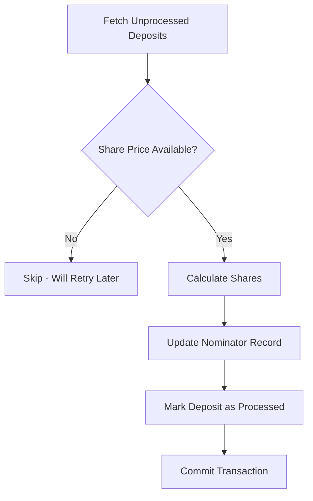
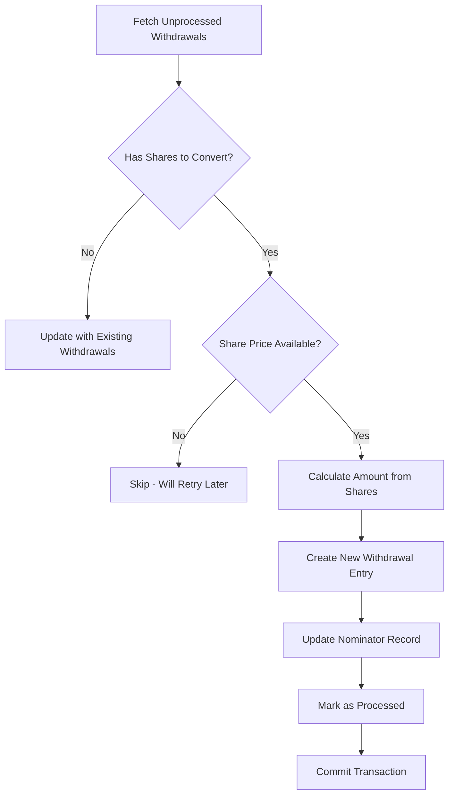
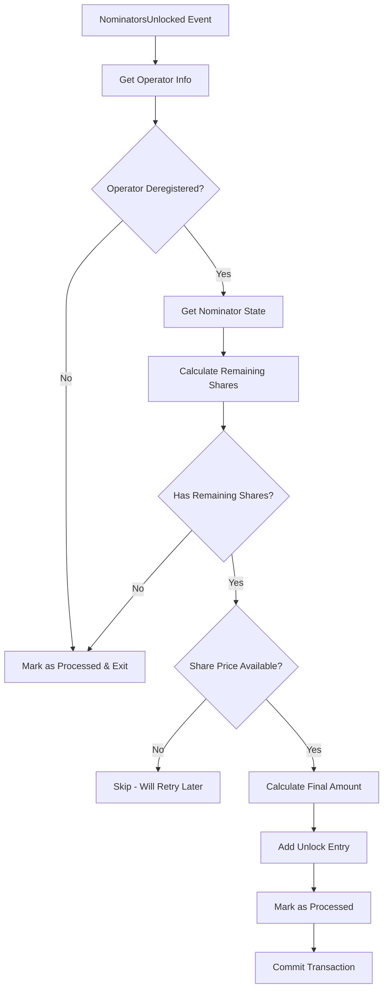

# Staking Worker Flows Documentation

This document provides a detailed explanation of how each flow in the staking worker operates, including the step-by-step processes, database operations, and calculations involved.

## Table of Contents

1. [Overview](#overview)
2. [Deposit Flow](#deposit-flow)
3. [Withdrawal Flow](#withdrawal-flow)
4. [Unlock Flow](#unlock-flow)
5. [Operator Registration Flow](#operator-registration-flow)
6. [Operator Rewards Flow](#operator-rewards-flow)
7. [Operator Tax Collection Flow](#operator-tax-collection-flow)
8. [Bundle Submission Flow](#bundle-submission-flow)
9. [Operator Deregistration Flow](#operator-deregistration-flow)
10. [Nominators Unlocked Flow](#nominators-unlocked-flow)

## Overview

The staking worker is responsible for processing various staking-related events that require lazy conversion or aggregation. It operates on a 1-second interval, processing batches of up to 100 tasks split evenly across 9 different task types.

### Key Principles

1. **Lazy Conversion**: Mimics the runtime behavior where conversions only happen when share prices are available
2. **Data Integrity**: Never modifies raw blockchain data, only updates calculated values and processed flags
3. **Transaction Safety**: All operations are wrapped in database transactions
4. **Parallel Processing**: Tasks are processed in parallel with deadlock prevention through consistent ordering

### Constants

- `SHARES_CALCULATION_MULTIPLIER = 10^18` (for precision in share calculations)
- Default batch size: 100 tasks
- Default finality threshold: 100 blocks
- Processing interval: 1 second

## Deposit Flow

### Purpose
Converts pending deposits (in tokens) to known deposits (in shares) when the share price for the effective epoch becomes available.

### Prerequisites
- Deposit event recorded in `staking.nominator_deposits` table
- Share price available for `pending_effective_domain_epoch`

### Step-by-Step Process

1. **Fetch Unprocessed Deposits**
   ```sql
   SELECT * FROM staking.nominator_deposits 
   WHERE processed = false 
   AND pending_amount > 0
   AND block_height <= (chain_tip - finality_threshold)
   ORDER BY block_height ASC
   ```

2. **Check Share Price Availability**
   ```sql
   SELECT share_price FROM staking.operator_epoch_share_prices
   WHERE operator_id = ? AND domain_id = ? AND epoch_index = ?
   ```

3. **Calculate Shares** (if share price available)
   ```typescript
   newShares = (pendingAmount * SHARES_CALCULATION_MULTIPLIER) / sharePrice
   ```

4. **Update Nominator Record**
   ```typescript
   totalKnownShares = existingKnownShares + newShares
   totalKnownStorageFeeDeposit = existingKnownStorageFeeDeposit + pendingStorageFeeDeposit
   depositAmount = pendingAmount + pendingStorageFeeDeposit
   ```

5. **Database Updates**
   ```sql
   -- Insert or update nominator
   INSERT INTO staking.nominators (
     id, address, domain_id, operator_id,
     known_shares, known_storage_fee_deposit,
     total_deposits, total_deposits_count
   ) VALUES (?, ?, ?, ?, ?, ?, ?, 1)
   ON CONFLICT (id) DO UPDATE SET
     known_shares = ?,
     known_storage_fee_deposit = ?,
     total_deposits = nominators.total_deposits + ?,
     total_deposits_count = nominators.total_deposits_count + 1
   
   -- Mark deposit as processed
   UPDATE staking.nominator_deposits SET processed = true WHERE id = ?
   ```

### Example Calculation
```
Given:
- pendingAmount = 1000 tokens (1000 * 10^18 smallest units)
- pendingStorageFeeDeposit = 200 tokens (200 * 10^18 smallest units)
- sharePrice = 2 * 10^18 (2 tokens per share)

Calculation:
- newShares = (1000 * 10^18 * 10^18) / (2 * 10^18) = 500 * 10^18 shares
- depositAmount = 1000 + 200 = 1200 tokens
```

## Withdrawal Flow

### Purpose
Converts withdrawal requests in shares (`withdrawalInShares`) to withdrawal amounts in tokens when the share price becomes available.

### Prerequisites
- Withdrawal event recorded in `staking.nominator_withdrawals` table
- Share price available for `withdrawal_in_shares_domain_epoch`

### Step-by-Step Process

1. **Fetch Unprocessed Withdrawals**
   ```sql
   SELECT * FROM staking.nominator_withdrawals
   WHERE processed = false
   AND block_height <= (chain_tip - finality_threshold)
   ```

2. **Parse Withdrawal Data Structure**
   ```typescript
   withdrawalData = {
     totalWithdrawalAmount: BigInt,
     totalStorageFeeWithdrawal: BigInt,
     withdrawals: Array<{
       unlockAtConfirmedDomainBlockNumber: number,
       amountToUnlock: string,
       storageFeeRefund: string
     }>,
     withdrawalInShares: {
       domainEpoch: string,
       unlockAtConfirmedDomainBlockNumber: string,
       shares: BigInt,
       storageFeeRefund: BigInt
     }
   }
   ```

3. **Check for Shares to Convert**
   - If `withdrawalInShares.shares == 0`, skip conversion
   - Otherwise, fetch share price for the epoch

4. **Calculate Withdrawal Amount**
   ```typescript
   amountToUnlock = (shares * sharePrice) / SHARES_CALCULATION_MULTIPLIER
   ```

5. **Create New Withdrawal Entry**
   ```typescript
   newWithdrawalEntry = {
     unlockAtConfirmedDomainBlockNumber: withdrawalInShares.unlockAtConfirmedDomainBlockNumber,
     amountToUnlock: amountToUnlock.toString(),
     storageFeeRefund: withdrawalInShares.storageFeeRefund.toString()
   }
   ```

6. **Update Aggregated Values**
   ```typescript
   updatedWithdrawals = [...existingWithdrawals, newWithdrawalEntry]
   updatedTotalWithdrawalAmount = totalWithdrawalAmount + amountToUnlock
   ```

7. **Database Updates**
   ```sql
   -- Update nominator
   INSERT INTO staking.nominators ... 
   ON CONFLICT (id) DO UPDATE SET
     total_withdrawals = ?,
     total_withdrawals_count = nominators.total_withdrawals_count + 1,
     total_storage_fee_refund = ?,
     withdrawn_shares = nominators.withdrawn_shares + ?,
     unlock_at_confirmed_domain_block_number = ?::jsonb
   
   -- Mark withdrawal as processed
   UPDATE staking.nominator_withdrawals SET processed = true WHERE id = ?
   ```

### Example Calculation
```
Given:
- withdrawalInShares.shares = 250 * 10^18 shares
- sharePrice = 2.5 * 10^18 (2.5 tokens per share)
- withdrawalInShares.storageFeeRefund = 50 * 10^18

Calculation:
- amountToUnlock = (250 * 10^18 * 2.5 * 10^18) / 10^18 = 625 * 10^18 tokens
- Total withdrawal value = 625 + 50 = 675 tokens
```

## Unlock Flow

### Purpose
Processes unlock claims when nominators unlock their funds after the unlock period.

### Prerequisites
- Unlock event recorded in `staking.unlocked_events` table
- Corresponding withdrawal entry exists with matching unlock block

### Step-by-Step Process

1. **Fetch Unprocessed Unlocks**
   ```sql
   SELECT * FROM staking.unlocked_events
   WHERE processed = false
   AND block_height <= (chain_tip - finality_threshold)
   ```

2. **Update Nominator Claimed Amounts**
   ```sql
   INSERT INTO staking.nominators ...
   ON CONFLICT (id) DO UPDATE SET
     total_claimed_amount = nominators.total_claimed_amount + ?,
     total_claimed_storage_fee = nominators.total_claimed_storage_fee + ?
   ```

3. **Mark Unlock as Processed**
   ```sql
   UPDATE staking.unlocked_events SET processed = true WHERE event_id = ?
   ```

### Database Updates
- Increments `total_claimed_amount` by the unlock amount
- Increments `total_claimed_storage_fee` by the storage fee refund
- Updates `updated_at` timestamp

## Operator Registration Flow

### Purpose
Records new operator registrations in the aggregated operators table.

### Step-by-Step Process

1. **Fetch Unprocessed Registrations**
   ```sql
   SELECT * FROM staking.operator_registrations
   WHERE processed = false
   ```

2. **Insert Operator Record**
   ```sql
   INSERT INTO staking.operators (
     id, address, domain_id, signing_key,
     minimum_nominator_stake, nomination_tax,
     total_tax_collected, total_rewards_collected,
     bundle_count, status
   ) VALUES (?, ?, ?, ?, ?, ?, 0, 0, 0, 'active')
   ON CONFLICT (id) DO NOTHING
   ```

3. **Mark Registration as Processed**
   ```sql
   UPDATE staking.operator_registrations SET processed = true WHERE id = ?
   ```

## Operator Rewards Flow

### Purpose
Accumulates operator rewards in the aggregated operators table.

### Step-by-Step Process

1. **Fetch Unprocessed Rewards**
   ```sql
   SELECT * FROM staking.operator_rewards WHERE processed = false
   ```

2. **Update Operator Totals**
   ```sql
   UPDATE staking.operators 
   SET total_rewards_collected = total_rewards_collected + ?
   WHERE id = ?
   ```

3. **Mark as Processed**

## Operator Tax Collection Flow

### Purpose
Accumulates tax collections in the aggregated operators table.

### Process
Similar to rewards flow but updates `total_tax_collected` field.

## Bundle Submission Flow

### Purpose
Counts bundle submissions for each operator.

### Process
Increments `bundle_count` for the operator.

## Operator Deregistration Flow

### Purpose
Updates operator status and records deregistration details.

### Step-by-Step Process

1. **Fetch Operator State at Deregistration Block**
   ```typescript
   const blockHash = await getBlockHash(deregistrationBlockHeight)
   const operatorData = await queryOperatorById(operatorId, blockHash)
   ```

2. **Extract Deregistration Details**
   - `unlockAtConfirmedDomainBlockNumber`: Block when funds can be unlocked
   - `domainEpoch`: Epoch when deregistration occurred

3. **Update Operator Record**
   ```sql
   UPDATE staking.operators SET
     status = 'deregistered',
     unlock_at_confirmed_domain_block_number = ?,
     deregistration_domain_epoch = ?
   WHERE id = ?
   ```

## Nominators Unlocked Flow

### Purpose
Processes nominator unlocks after operator deregistration, calculating the final amounts based on remaining shares.

### Prerequisites
- Operator has been deregistered
- `NominatorsUnlocked` event triggered
- Share price available for deregistration epoch

### Step-by-Step Process

1. **Fetch Operator Deregistration Info**
   ```sql
   SELECT unlock_at_confirmed_domain_block_number, deregistration_domain_epoch
   FROM staking.operators WHERE id = ?
   ```

2. **Fetch Nominator State**
   ```sql
   SELECT known_shares, withdrawn_shares, known_storage_fee_deposit
   FROM staking.nominators WHERE id = ?
   ```

3. **Calculate Remaining Shares**
   ```typescript
   remainingShares = knownShares - withdrawnShares
   ```

4. **Get Share Price at Deregistration Epoch**
   ```sql
   SELECT share_price FROM staking.operator_epoch_share_prices
   WHERE operator_id = ? AND epoch_index = deregistration_epoch
   ```

5. **Calculate Final Amount**
   ```typescript
   amount = (remainingShares * sharePrice) / SHARES_CALCULATION_MULTIPLIER
   ```

6. **Update Nominator with Unlock Entry**
   ```typescript
   newUnlockEntry = {
     block: operatorUnlockBlock,
     amount: calculatedAmount,
     storageFeeRefund: knownStorageFeeDeposit
   }
   ```

### Example Calculation
```
Given:
- knownShares = 1000 * 10^18
- withdrawnShares = 300 * 10^18
- sharePrice at deregistration = 1.5 * 10^18
- knownStorageFeeDeposit = 200 * 10^18

Calculation:
- remainingShares = 1000 - 300 = 700 * 10^18
- amount = (700 * 10^18 * 1.5 * 10^18) / 10^18 = 1050 * 10^18
- Total unlock = 1050 + 200 = 1250 tokens
```

## Error Handling

All flows implement:
- **Retry logic**: Exponential backoff for transient failures
- **Transaction rollback**: On any error, the entire transaction is rolled back
- **Deadlock prevention**: Consistent ordering by operatorId → domainId → address
- **Logging**: Detailed error logging with database error codes

## Performance Considerations

1. **Parallel Processing**: Tasks are processed in parallel with configurable concurrency
2. **Batch Processing**: Up to 100 tasks per batch
3. **Connection Pooling**: Database connection pool size configurable
4. **Finality Threshold**: Only processes events that are finalized (100+ blocks old)

## Testing Considerations

Each flow should be tested for:
- Happy path scenarios
- Missing share prices
- Zero amounts
- Duplicate processing prevention
- Transaction rollback on errors
- Concurrent processing
- Edge cases specific to each flow

## Visual Flow Diagrams

### Deposit Flow Diagram


### Withdrawal Flow Diagram


### Nominators Unlocked Flow Diagram


## Common Edge Cases and Solutions

### 1. Missing Share Prices
**Problem**: Share price not yet available for the epoch  
**Solution**: Skip processing and retry in next batch  
**Impact**: Delays conversion but maintains data integrity

### 2. Zero Amount Transactions
**Problem**: Deposits or withdrawals with zero amounts  
**Solution**: Process normally but skip calculations  
**Impact**: Updates counts without affecting balances

### 3. Concurrent Updates
**Problem**: Multiple workers updating same nominator  
**Solution**: Row-level locking and consistent ordering  
**Impact**: Slight performance impact but prevents conflicts

### 4. Operator Deregistration Race Conditions
**Problem**: Nominator operations during deregistration  
**Solution**: Check operator status before processing  
**Impact**: May require additional retries

### 5. Partial Batch Failures
**Problem**: Some tasks in batch fail while others succeed  
**Solution**: Individual task transactions, track success count  
**Impact**: Partial progress is preserved

## Database Schema Summary

### Key Relationships
```
nominators (id) = address-domainId-operatorId
operators (id) = operatorId
operator_epoch_share_prices (composite key) = operatorId + domainId + epochIndex
```

### Critical Fields for Calculations
- `nominators.known_shares`: Current shares after conversions
- `nominators.withdrawn_shares`: Shares that have been withdrawn
- `nominators.unlock_at_confirmed_domain_block_number`: JSONB array of pending unlocks
- `operators.deregistration_domain_epoch`: Used to find share price for final calculations

## Monitoring and Observability

### Key Metrics to Track
1. **Processing Rate**: Tasks processed per second
2. **Conversion Success Rate**: Successful conversions vs retries
3. **Share Price Availability**: Percentage of tasks waiting for share prices
4. **Transaction Rollback Rate**: Failed transactions requiring retry
5. **Queue Depth**: Number of unprocessed tasks

### Log Patterns
```
[INFO] Processing batch of X tasks
[INFO] Converted deposit: operator=X, shares=Y
[WARN] Share price not available: epoch=X, operator=Y
[ERROR] Transaction failed: error=X, will retry
```

## Future Improvements

1. **Caching**: Cache share prices in Redis to reduce database queries
2. **Batch Share Price Fetching**: Fetch all required share prices in one query
3. **Smart Retry Logic**: Prioritize tasks more likely to succeed
4. **Metrics Dashboard**: Real-time monitoring of worker performance
5. **Historical Data Migration**: Tool to reprocess historical data if needed 